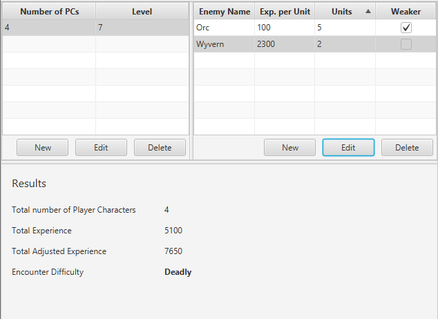

# Challenge-Calculator

This program can be used to determine how challenging an encounter in Dungeons & Dragons (5th edition) could be, based on the algorithm presented in the Dungeon Master's Guide.
<br />
<br />


## Run
You can easily run the application with maven:
```
mvn clean javafx:run
```
To build an executable jar and run it:
```
mvn package
java -jar ./target/cr-calculator-1.0-SNAPSHOT.jar
```